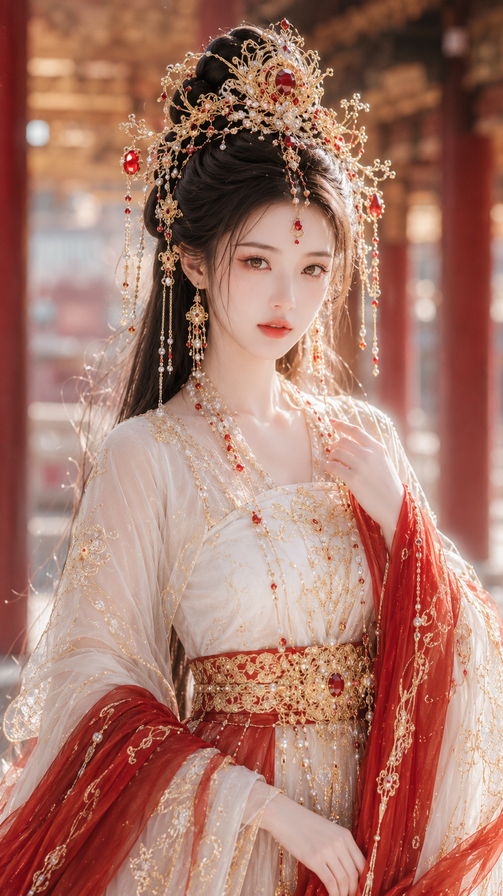

[English](README.md) | [简体中文](README_zh.md) | [日本語](README_ja.md) | [한국어](README_ko.md)

# 女性人像提示词导演 Skill

输入少量写真参数，生成一张人物、动作、服装、场景、镜头与光线彼此成立的照片；也可以直接出图，并保留已授权的人物或产品参考主体。

[](https://skills.sh/liyue-aigc/female-portrait-director)
[](https://github.com/liyue-aigc/female-portrait-director/stargazers)
[](LICENSE)

它不是普通提示词合集。Skill 会锁定用户的明确要求，只选择一个视觉 Route，再把人物、事件、服装、空间、镜头、光线和滤镜组织成同一个可拍摄瞬间。没有授权参考图时，人物默认为虚构且明确成年的女性。

## 先看结果

| 清纯生活 | 都市时尚 | 古风仙侠 |
| --- | --- | --- |
|  |  |  |
| 港风街拍 | 法式慵懒 | 纯欲曲线 |
|  |  |  |

六个案例依次展示：清纯生活、都市时尚、古风仙侠、港风街拍、法式慵懒和纯欲曲线。

## 60 秒开始使用

使用开源 `skills` CLI 一键安装：

```bash
npx skills add https://github.com/liyue-aigc/female-portrait-director/tree/main/skills/female-portrait-director -g
```

重新开始一个 Agent 对话，然后粘贴：

```text
使用 $female-portrait-director 直接生成图片：
风格：清纯生活照
场景：午后安静的咖啡馆靠窗座位
服装：米白针织开衫 + 浅色内搭
气质：温柔、自然、明确成年
画幅：3:4
```

如果只需要可复制提示词，删除“直接生成图片”即可。Skill 会返回参数锁定、导演式提示词和负面约束。

## Agent 兼容性

当前 `skills` CLI 已对完整的 61 文件分发包完成以下目标端安装验证：

| Agent | 安装包 | 提示词工作流 | 直接生图工作流 |
| --- | --- | --- | --- |
| Codex | 已验证 | 已实机运行 | 宿主提供生图能力时支持 |
| Claude Code | 已验证 | 兼容 Agent Skills | 取决于所连接的生图工具 |
| Cursor | 已验证 | 兼容 Agent Skills | 取决于所连接的生图工具 |
| GitHub Copilot | 已验证 | 兼容 Agent Skills | 取决于所连接的生图工具 |
| Gemini CLI | 已验证 | 兼容 Agent Skills | 取决于所连接的生图工具 |

“安装包已验证”表示安装器会把 `SKILL.md` 以及它引用的全部 Route、工具、安全规则和示例复制到目标 Skill 中。本次发布环境只对 Codex 做了实际运行验证；其余行表示分发结构与 Agent Skills 规范兼容，并不表示每个宿主都自带图像模型。

## 支持风格

- 清纯生活照
- 纯欲曲线生活照
- 都市时尚写真
- 古风仙侠美人图
- 电商服装模特图
- 复古港风写真
- 法式慵懒写真
- 新中式东方写真
- 活力运动写真
- 旅行假日写真
- 影楼精修写真
- 东方丰腴写真
- 清冷仙气古风增强版
- 明媚华贵古风增强版
- 超近景真实人脸人像
- 古风贵女水光妆
- 黑珍珠墨金CCD曲线生活照
- 元气丰腴柔光CCD生活照
- 冷白清透CCD曲线生活照

完整的新手教学、19 风格菜单和参数转五段式详细提示词示例见 [首次使用帮助](skill/help.md)。

## 核心能力

- 锁定用户已经填写的参数，只做细化和稳定化补全。
- 根据目标风格按需加载单一路由，避免互相冲突的风格词堆叠。
- 拆解五官、身形、服装、场景、镜头姿态、光线和滤镜模块。
- 将短参数扩写为可拍摄的具体瞬间，避免机械复述和填空式输出。
- 将各模块融合为自然、完整、可直接复制的摄影导演式提示词。
- 为电商图片保留服装展示优先级，为曲线风格保留明确的安全边界。
- 支持授权自拍五官或产品核心视觉锁定后的参考图直接生成。

## 安装与更新

一键安装需要包含 `npx` 的 [Node.js](https://nodejs.org/)。后续更新已安装的 Skill：

```bash
npx skills@latest update female-portrait-director -g -y
```

### 使用 Git 手动安装到 Codex

也可以将仓库克隆到 Codex 的 skills 目录。

Windows PowerShell：

```powershell
git clone https://github.com/liyue-aigc/female-portrait-director.git "$env:USERPROFILE\.codex\skills\female-portrait-director"
```

macOS 或 Linux：

```bash
git clone https://github.com/liyue-aigc/female-portrait-director.git "${CODEX_HOME:-$HOME/.codex}/skills/female-portrait-director"
```

重启 Codex 或重新开始一个对话，然后调用：

```text
$female-portrait-director
```

首次无参数调用会显示 V1.5 教程：19 种已实现风格、基础与高级模板、风格 + 气质组合规则、参数生成详细提示词示例，以及直接出图与授权参考图用法。

## 示例：从参数到导演式扩写

这个 Skill 不只是复述用户输入。它会保留明确参数，补全缺失的视觉细节，并输出参数锁定结果、导演式模块解析、完整提示词和负面约束。

```text
写真风格：古风仙侠美人图
场景方向：云雾山水间的古风庭院回廊
服装方向：月白色唐风幻想大袖衫 + 轻盈披帛 + 银色刺绣腰封
气质标签：清冷、疏离、仙气
五官方向：古典东方美人脸
身形方向：纤细清瘦身形
镜头方向：轻侧身站姿，半身到大腿构图
光线氛围：冷调柔光
滤镜效果：清冷仙气古风滤镜
画幅比例：9:16
平台用途：角色写真
```


## 输出格式

```text
一、参数锁定结果
二、模块解析
三、最终提示词
四、负面约束
```

## 文件结构

```text
.
├── README.md
├── README_zh.md
├── README_ja.md
├── README_ko.md
├── SKILL.md
├── agents/openai.yaml
├── assets/examples/
├── skill/
│   ├── skill.md
│   ├── style-registry.md
│   ├── help.md
│   ├── public_instructions.md
│   ├── parameter_schema.md
│   ├── usage_examples.md
│   ├── core/
│   ├── references/
│   │   ├── director-expansion.md
│   │   └── visual-libraries.md
│   └── routes/
│       ├── beauty/
│       ├── commercial/
│       ├── curve/
│       ├── fantasy/
│       ├── fashion/
│       ├── lifestyle/
│       ├── oriental/
│       └── realism/
├── docs/
│   ├── style_guide.md
│   ├── prompt_safety.md
│   ├── versioning.md
│   └── faq.md
└── examples/
```

## 安全边界

文本生图默认使用虚构、明确成年的人物。参考图工作流允许保留用户本人或已授权成年人物的身份，也允许保留用户有权使用的产品视觉。禁止用于未成年人性化、色情裸露、非自愿图像、欺骗性身份内容、骚扰、诽谤、隐私侵犯或其他违法违规用途。详细规则参见 [prompt_safety.md](docs/prompt_safety.md) 和 [DISCLAIMER.md](DISCLAIMER.md)。

## License

本项目使用 [MIT License](LICENSE)。MIT License 允许使用、复制、修改、合并、发布、分发、再许可和销售副本。安全边界属于合理使用说明，不改变 MIT License 的标准授权范围。

## 作者与版本

- 作者：李岳
- 版本：`FEMALE-PORTRAIT-DIRECTOR-V1.5`
- 项目：`Female Portrait Prompt Director Skill`
